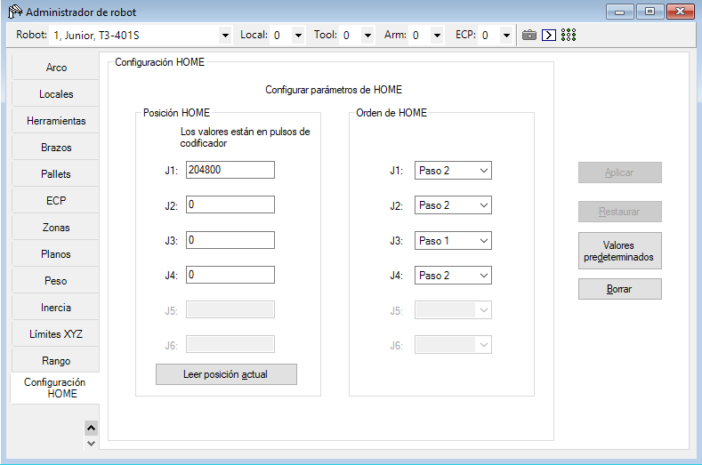
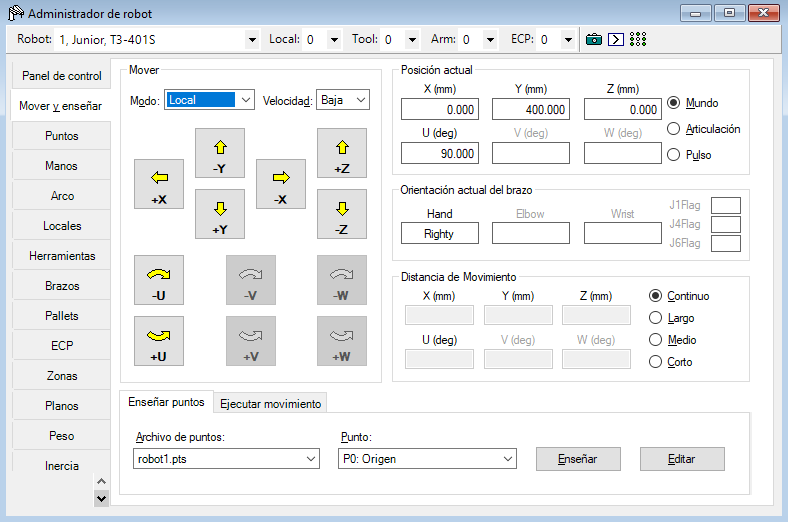
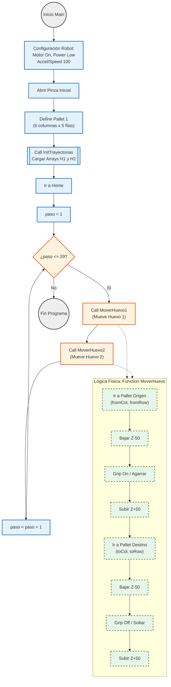
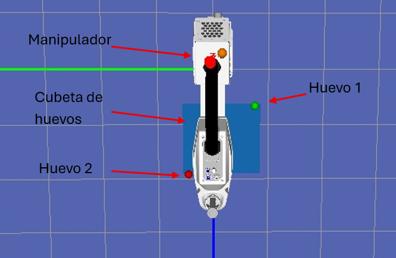

# Laboratorio_03
* Sergio Avellaneda Piñeros
* David Santiago Cuellar Lopez
* Brayan Yesid Santos Gonzalez

## Cuadro comparativo Motoman MH6 vs ABB IRB 140 vs Epson T3-401S

| **Motoman MH6** | **ABB IRB 140** | **Epson T3-401S** |
|-----------------|-----------------|-------------------|
| <ul><li>Ofrece una carga de 6 kg.</li><li>Un alcance máximo de 1422 mm.</li><li>Tiene 6 grados de libertad + 2 agregados.</li><li>Velocidades en los ejes:<ul><li>Eje 1 (S): 220 °/s</li><li>Eje 2 (L): 200 °/s</li><li>Eje 3 (U): 220 °/s</li><li>Eje 4 (R): 410 °/s</li><li>Eje 5 (B): 410 °/s</li><li>Eje 6 (T): 610 °/s</li><li>Eje 7 y 8: desconocidas.</li></ul></li><li>Peso del manipulador: 130 kg.</li><li>Repetibilidad de 0.08 mm.</li><li>Se usa comúnmente en manipulación de materiales, corte / desbaste, manipulación en celdas compactas.</li></ul> | <ul><li>Ofrece una carga de 6 kg.</li><li>Un alcance máximo de 810 mm.</li><li>Tiene 6 grados de libertad.</li><li>Velocidades de los ejes:<ul><li>Eje 1: 200 °/s</li><li>Eje 2: 200 °/s</li><li>Eje 3: 260 °/s</li><li>Eje 4: 360 °/s</li><li>Eje 5: 360 °/s</li><li>Eje 6: 450 °/s</li></ul></li><li>Peso del manipulador: 98 kg.</li><li>Repetibilidad de 0.03 mm.</li><li>Se usa comúnmente en manipulación de materiales, tendedora de máquina, ensamblaje, soldadura por arco, limpieza/pulido, pick & place en alta velocidad.</li></ul> | <ul><li>Ofrece una carga máxima de 3 kg.</li><li>Un alcance máximo de 400 mm.</li><li>Tiene 4 grados de libertad (robot SCARA de mesa).</li><li>Velocidades de referencia:<ul><li>Ejes J1+J2: 3.7 m/s.</li><li>Eje J3: 1.0 m/s.</li><li>Eje J4: 2600 °/s.</li></ul></li><li>Peso del manipulador: 16 kg.</li><li>Repetibilidad de 0.02 mm.</li><li>Se usa comúnmente en aplicaciones de pick & place, alimentación de piezas, ensamblaje ligero, inspección y pruebas sobre mesa.</li></ul>|

En este laboratorio, el trabajo con el Epson T3-401S tuvo una dinámica distinta porque, a diferencia del Motoman MH6 y del ABB IRB 140 (ambos manipuladores articulados de 6 grados de libertad), el Epson es un robot de tipo SCARA con 4 grados de libertad, optimizado específicamente para tareas de pick and place y manipulación rápida sobre una mesa de trabajo. Su alcance es considerablemente menor que el de los otros dos robots, de tan solo 400 mm, lo que limita el volumen de trabajo pero al mismo tiempo favorece un diseño compacto y muy rígido.

A pesar de su menor alcance y de que solo puede manejar aproximadamente la mitad de la carga útil de los otros robots (3 kg frente a 6 kg), el Epson T3-401S presenta características muy importantes para aplicaciones de alta velocidad: el peso del manipulador es significativamente más bajo, sus ejes en el plano X–Y (J1 y J2) están optimizados para movimientos muy rápidos y repetitivos, y la estructura SCARA está diseñada para acelerar y frenar con tiempos de ciclo muy cortos. Gracias a ello, y según las especificaciones del fabricante, este es el robot más preciso de los tres analizados en cuanto a repetibilidad, lo que lo convierte en la mejor opción cuando se requiere posicionamiento fino y ciclos rápidos en un área de trabajo reducida.

## Configuraciones de home
Para configurar la posición Home del EPSON T3-401S se utilizó el software EPSON RC+ 7.0, desde el cual se puede manipular y parametrizar el robot. Por defecto, el Home del equipo corresponde a una postura completamente extendida hacia el eje X (hacia la derecha del robot). Para ajustarlo, se ingresó al menú de administrador del robot, en la opción de configuración de Home, y se modificó el valor de la articulación J1 asignándole 204 800 pulsos, lo que corresponde a una rotación aproximada de 90° respecto a la posición horizontal inicial. Es importante asegurarse de que, en la secuencia de retorno a Home, el primer movimiento lo realice la articulación J3 (eje vertical), de manera que el efector final se eleve antes de girar en el plano y así se eviten posibles colisiones con la mesa o con la pieza.

## Movimientos manuales

El manipulador puede operarse manualmente mediante teach pendant; sin embargo, como la universidad no adquirió este dispositivo, es necesario controlarlo desde el software. Para ello, desde el menú de administrador del robot, en la opción Mover y enseñar, es posible desplazar el manipulador de forma manual tanto en coordenadas cartesianas (modo mundo o modo local) como en modo articular, y así enseñar las posiciones requeridas directamente desde EPSON RC+ 7.0.

## Niveles de velocidad

El nivel de velocidad se puede controlar desde el software, en el menú de administrador del robot, en la opción Panel de control, donde se encuentran dos modos de potencia que afectan directamente la velocidad: Power Low (baja potencia) y Power High (alta potencia). Además, desde el menú Ejecutar es posible forzar el modo de baja potencia al cargar y ejecutar un programa, lo que resulta útil para probar un código de forma más segura.

## Principales funcionalidades de EPSON RC+ 7.0

EPSON RC+ 7.0 es el entorno oficial para programar y controlar robots EPSON como el T3-401S. Desde el software se crean y editan programas, se enseñan puntos en coordenadas cartesianas o articulares, se configuran herramientas y sistemas de referencia, y se supervisa el estado del robot (posiciones, errores, entradas y salidas, modo de operación). En la práctica, es el lugar donde se desarrolla, prueba y organiza todo lo que el manipulador va a ejecutar.

La comunicación se realiza entre el PC y el controlador del robot, en este caso via USB. EPSON RC+ envía al controlador órdenes de alto nivel, como ejecutar un programa o mover a una posición enseñada, y el controlador se encarga de traducir estas órdenes en movimientos reales: verifica que no haya alarmas, aplica límites y parámetros de seguridad, calcula la trayectoria y genera las consignas para cada eje. Mientras tanto, devuelve a EPSON RC+ información de estado para que el operador pueda ver el avance del programa y detenerlo si es necesario.

## RoboDK vs RobotStudio vs EPSON RC+ 7.0
Para comparar RoboDK, RobotStudio y EPSON RC+ 7.0, primero es importante entender qué hace cada software y cómo se relaciona con la arquitectura del robot que controla.

RoboDK es un entorno de simulación y programación offline compatible con robots de prácticamente todas las marcas grandes. Incluye una librería muy amplia de modelos de robots y postprocesadores capaces de generar código listo para ejecutarse en el controlador de cada fabricante. Su filosofía de uso es programar y simular en el computador, generar el código y llevarlo al robot sin necesidad de enseñarle punto por punto de forma manual en la celda real, lo que reduce tiempos de parada y evita ocupar un robot de producción para tareas de programación. RoboDK también permite trabajar con ejes externos como rieles lineales y posicionadores rotativos dentro de la misma estación virtual; esto es especialmente útil en escenarios como el del MH6 montado sobre un riel con un posicionador externo, ya que el software puede simular esa celda extendida y generar trayectorias que ya contemplan esos grados de libertad adicionales. Una de sus mayores ventajas es que es multimarca y ofrece una API (por ejemplo en Python) que permite automatizar la generación de rutas, calibraciones o incluso mover el robot en vivo desde un script. Su principal limitación es que no simula el firmware real de cada marca, por lo que ciertos aspectos relacionados con seguridad, aceleraciones, límites y sincronización fina deben verificarse directamente en el robot físico.

RobotStudio, por su parte, es el entorno oficial de ABB y utiliza el “Virtual Controller”, que es esencialmente el mismo software que corre dentro del controlador físico de ABB pero ejecutado en el PC. Esto permite simular trayectorias, configuraciones de I/O, datos de herramienta y workobject, y lógica en RAPID con un comportamiento muy cercano al del robot real. RobotStudio no solo planifica trayectorias: también permite configurar, depurar, hacer comisionamiento virtual, entrenar operadores mediante un FlexPendant virtual y transferir directamente el programa al controlador físico. Gracias a esta fidelidad, lo que se valida en RobotStudio suele funcionar con muy pocos cambios en el robot real. Su limitación principal es su enfoque exclusivo en robots ABB y en el lenguaje RAPID, además de que algunas funciones avanzadas requieren licencias pagas, lo cual puede ser una restricción en entornos académicos con varias estaciones de trabajo.

EPSON RC+ 7.0 es el entorno oficial para programar, simular y controlar robots EPSON, como el T3-401S utilizado en este laboratorio. A diferencia de los otros dos softwares, RC+ no es un sistema multimarca ni un simulador general, sino una herramienta integrada diseñada específicamente para manipulación de alta velocidad en robots SCARA y de 6 ejes de la marca. Desde este entorno se crean programas, se enseñan puntos, se configuran herramientas y sistemas de referencia y se gestionan entradas y salidas digitales. La comunicación con el robot se realiza directamente con el controlador del T3, generalmente por Ethernet, lo que permite enviar órdenes de movimiento, ejecutar programas y supervisar estado en tiempo real. Aunque RC+ no ofrece un nivel de simulación tan amplio como RoboDK ni un gemelo digital tan fiel como RobotStudio, sí proporciona una integración profunda con la cinemática SCARA, tiempos de ciclo y herramientas propias del controlador EPSON, lo que permite trabajar con gran precisión y rapidez. Su limitación más notable es que está completamente orientado a la familia EPSON y no sirve para robots de otras marcas.

## Diseño técnico del gripper
Se diseñó en grupo el gripper que utilizaría el grupo 2, como se muestra en el [Plano](Imagenes/PlanoGripper.pdf). Para su montaje se usaron 2 tornillos M3 para sujetarlo al chaflán de ensamble del EPSON T3-401S y 2 tornillos M6 para fijar la chupa (ventosa) que permitía la succión. Para accionar la chupa se configuró la salida digital `Out_9`, la cual trabaja con lógica negada: cuando la salida está encendida la válvula se desactiva y la chupa se apaga; cuando la salida se apaga, la válvula se activa y la chupa enciende, generando succión sobre la pieza.

## Diagrama de flujo

## Plano de planta 

## Código en Python
Para este apartado se puede encontrar el código utilizado en la carpeta *"Código"*.

## Video de simulación e implementación
Para un mayor detalle de lo realizado, se puede ver el video de la simulación [aquí](https://youtu.be/SHn7KBpfFbk) y el de la implementación física [aquí](https://www.youtube.com/watch?v=a09duI1kMos).

