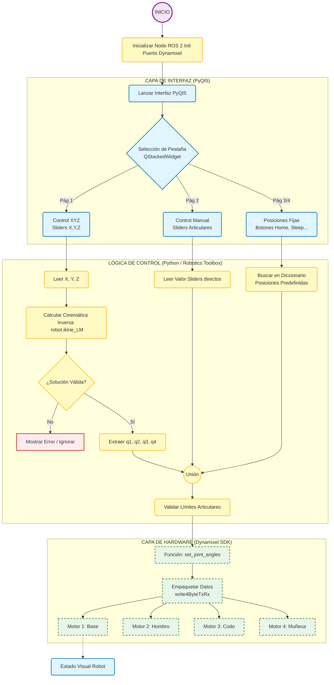
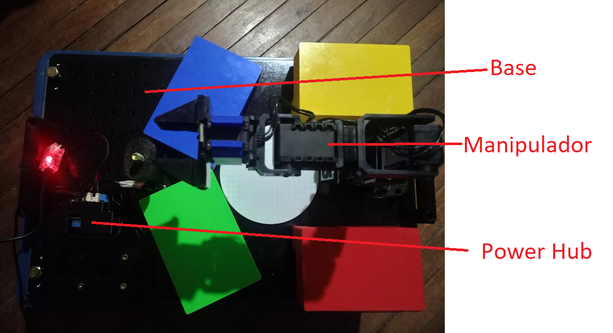

# Laboratorio_05
* Sergio Avellaneda Piñeros  
* David Santiago Cuellar Lopez  
* Brayan Yesid Santos Gonzalez  

## Descripción de la solución planteada

### Enfoque general del sistema

Se desarrolló una aplicación de software modular en Python 3 que opera como un nodo completo de ROS 2 Humble. El objetivo principal fue crear una interfaz humano-máquina (HMI) robusta, intuitiva y segura para el control y la teleoperación del brazo robótico Phantom X Pincher. 

La solución integra comunicación de bajo nivel con los servomotores Dynamixel AX-12A y una interfaz gráfica interactiva que permite controlar el robot tanto en espacio articular como en espacio cartesiano.

### Arquitectura del software

El diseño sigue un enfoque orientado a objetos y combina PyQt5 (para la interfaz gráfica) con rclpy (para la integración nativa con ROS 2). Para garantizar una respuesta fluida de la interfaz incluso durante operaciones intensivas, la ejecución se divide en dos hilos principales:

- **GUI**: responsable de la renderización de la ventana, captura de eventos del usuario y actualización visual en tiempo real.
- **ROS Spin**: ejecuta `rclpy.spin()` de forma independiente, manteniendo activa la comunicación ROS, los *callbacks* y los temporizadores sin bloquear la interfaz.

### Módulos funcionales principales

#### Gestión de conexión y comunicación con hardware

La comunicación con los actuadores se realiza directamente mediante el Dynamixel SDK (sin intermediarios como Dynamixel Workbench), lo que permite acceder a registros específicos requeridos.

- Detección automática de puertos seriales (`/dev/ttyUSB*`).
- Configuración del bus a 1 000 000 baudios con Protocolo 1.0 (compatible con AX-12A).
- Uso de funciones de bajo nivel (`write2ByteTxRx` y `write4ByteTxRx`) para control preciso de posición y torque de las cuatro articulaciones principales más el *gripper*, logrando una latencia mínima.

#### Modelado y control cinemático

Se empleó la biblioteca Robotics Toolbox for Python (RTB) de Peter Corke para el modelado del manipulador. Los parámetros Denavit-Hartenberg se definieron a partir de las dimensiones reales del Phantom X Pincher.

Para la cinemática directa, implementada en el modo **Control Manual**, se modifican los ángulos articulares \(q_1, q_2, q_3, q_4\) y se calcula y muestra instantáneamente la pose del efector final.

Para la cinemática inversa, disponible en el modo **Control XYZ**, se utilizó el *solver* numérico Levenberg–Marquardt (`ikine_LM`) para determinar los ángulos requeridos a partir de una posición cartesiana \((x, y, z)\) y una orientación deseada. El algoritmo demostró buena convergencia dentro del espacio de trabajo del robot.

La interfaz fue diseñada con PyQt5 y organizada mediante un `QStackedWidget` que permite cambiar fácilmente entre los siguientes modos de operación:

- **Dashboard**: conexión/desconexión, estado de torque, temperatura y diagnóstico básico de motores.
- **Control XYZ**: desplazamiento intuitivo del efector mediante coordenadas cartesianas, con validación automática del espacio alcanzable.
- **Control Manual**: *sliders* individuales para cada articulación con límites físicos preconfigurados (aproximadamente de −150° a +150°, mapeados a 0–1023).
- **Posiciones predefinidas**: botones de ejecución rápida para configuraciones comunes (*Home*, *Sleep*, *Ready*, *Straight Up*).
- **Visualización en tiempo real**: muestra de la pose actual del efector, ángulos articulares y estado del *gripper*.

#### Integración con ROS 2

La clase principal `PincherController` hereda de `rclpy.node.Node`, lo que convierte a la aplicación en un nodo ROS 2 completo. Aunque el control de motores se realiza directamente por medio del SDK de Dynamixel, toda la lógica de alto nivel se expone como parte del ecosistema ROS 2.

## Diagrama de flujo de acciones del robot 

## Plano de planta 

## Descripción de las funciones utilizadas

El núcleo del sistema está en la clase `PincherController`, que hereda de `rclpy.node.Node` y concentra las funciones de control del robot PhantomX Pincher. Durante su construcción se llaman funciones que leen parámetros de ROS2 (puerto serie, baudrate, IDs de los Dynamixel, límites y valores iniciales), abren el puerto serial y configuran el `PacketHandler` de Dynamixel. En este proceso se emplean funciones auxiliares como `write_goal_position`, `write_moving_speed` y `read_present_position`, que encapsulan el acceso a los registros de posición, velocidad y posición presente de cada motor, abstrayendo el detalle del protocolo y las direcciones internas.

Las funciones `dxl_to_radians`, `radians_to_dxl` y `degrees_to_dxl` realizan la conversión entre la representación en ticks de los servomotores y los ángulos físicos. A partir de estas conversiones, el controlador mantiene internamente el vector `current_joint_positions`, que se usa tanto para publicar el estado articular del robot como para la cinemática. La publicación periódica en el tópico `/joint_states` se realiza mediante la función `publish_joint_states`, que empaqueta los nombres de las articulaciones y los ángulos actuales en un mensaje `JointState` y lo envía para que RViz y otros nodos puedan visualizar el movimiento.

El modelo cinemático del brazo se construye con la función `build_pincher_robot`, que define los parámetros DH de cada eslabón y la transformación de herramienta. A partir de este modelo se utilizan dos funciones clave: `get_current_xyz`, que aplica la cinemática directa `fkine` para obtener las coordenadas cartesianas (x, y, z) del efector final a partir de `current_joint_positions`, y `move_to_xyz`, que resuelve la cinemática inversa mediante `ikine_LM`. Esta última función comprueba que el objetivo esté dentro del alcance permitido, genera una pose objetivo `T_target`, prueba varias semillas iniciales y selecciona la solución que minimiza el error de posición. Cuando encuentra una solución válida, delega en `move_to_joint_angles` para transformar los ángulos articulares en ticks Dynamixel y enviar los comandos a cada motor.

Las funciones de movimiento articular directo se organizan en varios niveles. `move_motor` recibe un ID de motor y un valor objetivo en ticks, valida si la parada de emergencia está activa, escribe el objetivo con `write_goal_position`, actualiza el ángulo correspondiente en `current_joint_positions` usando `dxl_to_radians` y emite una señal hacia la interfaz gráfica para que el slider asociado se sincronice. `move_to_angles_degrees` acepta una lista de ángulos en grados para los cinco motores, aplica el signo de cada articulación según la configuración física, utiliza `degrees_to_dxl` para la conversión y llama repetidamente a `move_motor`. `move_to_joint_angles` opera a nivel de radianes, se asegura de saturar los valores al rango físico permitido y convierte a ticks usando `radians_to_dxl` antes de enviar los objetivos a los Dynamixel.

Para el manejo general del sistema se cuenta con funciones como `initialize_motors`, que habilita el torque, fija la velocidad de trabajo y lleva los motores a su posición inicial; `update_speed` y `update_speed_single_motor`, que actualizan la velocidad interna y en los registros de los servos; `home_all_motors`, que llama internamente a `move_to_angles_degrees` para mover todos los ejes a 0°; `emergency_stop`, que deshabilita el torque de todos los motores y marca un flag de emergencia que bloquea nuevos movimientos; `reactivate_torque`, que permite recuperar el control después de una parada; y `close`, que se encarga de desactivar el torque y cerrar el puerto serie antes de salir de la aplicación.

En la interfaz gráfica, la clase `ModernPincherGUI` agrupa las funciones relacionadas con la creación y actualización de las distintas pestañas. `init_ui` construye la ventana principal, crea el `QStackedWidget` que contiene las páginas y configura la barra de estado. Funciones como `create_dashboard_page`, `create_manual_control_page`, `create_fixed_values_page`, `create_fixed_angles_page`, `create_xyz_page`, `create_visualization_page` y `create_info_page` se encargan de generar los controles, sliders, campos de entrada y botones de cada pestaña, conectando sus señales a las funciones del controlador ROS2. La clase `Aurora1304GUI` redefine `init_ui`, `create_topbar`, `create_pages` y `change_page` para reorganizar el layout y fijar el tamaño de la ventana en 1304×712, pero reutiliza las funciones de creación de páginas y las funciones de acción heredadas de `ModernPincherGUI`.

Las funciones de interacción entre GUI y controlador cierran el ciclo. `on_position_changed` actualiza los sliders cuando el controlador emite cambios de posición; `on_motor_slider_change` toma el valor del slider movido por el usuario, llama a `move_motor` en el controlador y actualiza el estado en la barra inferior; `on_speed_change` lee el valor del control de velocidad y lo envía a `update_speed`; `move_single_motor_from_entry` y `move_all_motors_from_entries` leen los valores numéricos introducidos en la pestaña de valores fijos y llaman a `move_motor` o `move_to_angles_degrees` según corresponda; `move_to_xyz_target` recoge las coordenadas objetivo desde la GUI, llama a `move_to_xyz` y muestra un mensaje de éxito o fallo; `move_to_preset_xyz` y `move_to_fixed_angles` implementan los presets cartesianos y articulares; y las funciones `home_all` y `emergency_stop` encapsulan el comportamiento de los botones HOME y EMERGENCIA, incluyendo el feedback visual en la barra de estado. Finalmente, `closeEvent` asegura que, al cerrar la ventana, se llamen las funciones `close` del controlador, se detengan los procesos externos y se ejecute `rclpy.shutdown()` para terminar ROS2 de manera ordenada.

## Código del script utilizado para el desarrollo de la práctica

Para ver el código, diríjase a la carpeta [Códigos](./Codigos/) y encontrará todos los paquetes usados.

## Videos

- **Video del brazo alcanzando cada posición solicitada.**  
  Ver video [aquí](https://youtu.be/2warnZ_yuoM).

- **Uso de la interfaz de usuario + Gráfica digital de las poses vs la fotografía del brazo real.**  
  Ver video [aquí](https://youtu.be/8Tcm-70TWkw).

