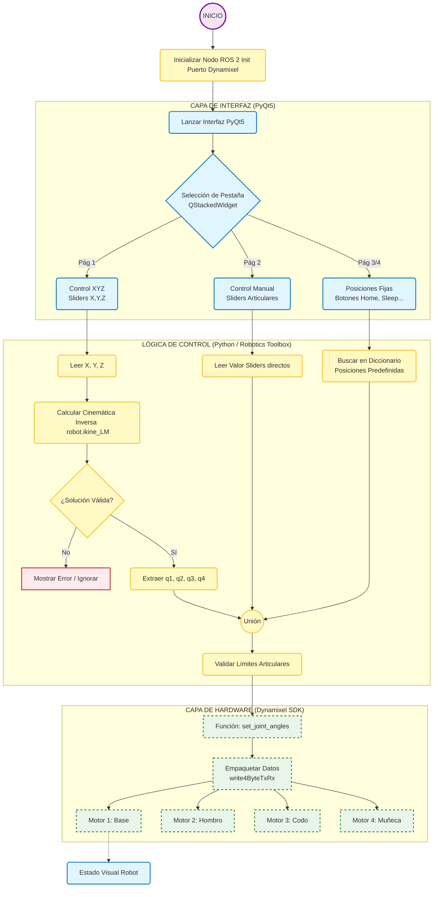

# Laboratorio_05
* Sergio Avellaneda Piñeros  
* David Santiago Cuellar Lopez  
* Brayan Yesid Santos Gonzalez  

## Descripción de la solución planteada

## Diagrama de flujo de acciones del robot 

## Plano de planta 

## Descripción de las funciones utilizadas

## Código del script utilizado para el desarrollo de la práctica

## Videos

- **Demostración de uso de la interfaz de usuario.**  
  Ver video [aquí](https://youtu.be/2warnZ_yuoM).

- **Uso de la interfaz de usuario + Gráfica digital de las poses vs la fotografía del brazo real.**  
  Ver video [aquí](https://youtu.be/8Tcm-70TWkw).

